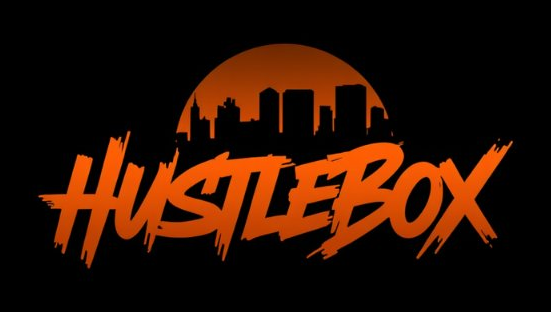

# HustleBox

> Street-level food truck game. Stack cash. Build rep. Stay out the back room (you won't).

HustleBox is a browser-based hustle game built around a single street corner. You're Marcus — 19, broke, working Uncle Ray's food truck on 5th and Main. Take orders, build the burgers right, ride the rep ladder from Dishwasher to Owner. Or duck down the alley to the back room and try your luck with Ray's other side business.

**Play in your browser:** [livescreate.github.io/HustleBox](https://livescreate.github.io/HustleBox/)
**Get the Android APK:** distributed privately —

---

## What's in the game

- **The Food Truck** — drag-and-drop ingredient assembly under a ticking timer. Get it right, the customer pays. Get it wrong, you eat the loss.
- **Career ladder** — Dishwasher → Prep Cook → Line Cook → Head Cook → Manager → Owner. Each rank earns wages over time and unlocks the next.
- **30 random events** — Big Order, Health Inspection, Drunk Customer, Loyal Regular, Supplier Deal, and 25 more. Mix of good and bad luck.
- **Reputation system** — Beloved, Respected, Known, Doubted, Blacklisted. Affects tips, customer flow, and event odds.
- **The Back Room** — basement under Sal's Hardware. Four playable games: Coin Flip (2x), Slots (up to 10x jackpot), Scratch Cards (up to 10x for three diamonds), and Dice over/under 7 (2x) or exact 7 (5x).
- **29 achievements** — Work, Stacks, Rep, Progression, Back Room, Secret.
- **Friends + cloud save** — Firebase auth, friend codes, QR invite scanning, cross-device save sync. Optional — guest mode works too, save lives in localStorage.
- **End-of-shift cinematic** — walking home, opening the front door, climbing into bed, snoring through to morning.
- **Graduation ending** — hit $1M lifetime and a letter arrives offering you a real chef job downtown. Game keeps going.

---

## Install as an app

**On Android (Chrome):** open the site → menu (three dots) → "Add to Home screen" → opens fullscreen, no browser chrome.

**On iOS (Safari):** open the site → Share button → "Add to Home Screen".

**On desktop (Chrome / Edge):** look for the install icon in the address bar.

The APK build is for private testing and isn't on Google Play.

---

## Tech stack

- **React** via CDN (no JSX, no build step — pure `React.createElement`)
- **Single-file `index.html`** — entire game ships as one HTML file
- **Firebase v10 (compat SDK)** — auth, Firestore, cloud save
- **Capacitor** — wraps the same HTML into an Android APK
- **Service Worker** — cache-first with version-bump-triggered hard refresh
- **localStorage** — for offline state + guest saves

No bundler. No framework lock-in. Open `index.html` in a browser and it runs.

---

## Build the Android APK

##You only need this if you want to package a new release as an APK.

**One-time setup:**
##- Install Node.js 20+, Android Studio, and Java JDK 17+
##- Add `ANDROID_HOME` to your env, pointing at your Android SDK
##- `npm install -g @capacitor/cli`

**Per-release:**
##1. Drop the updated `apk/index.html` into `C:\Projects\hustlebox\www\` (renamed to `index.html`)
##2. Drop the updated `news.json` into the same folder
##3. `npx cap sync`
##4. Open `android/` in Android Studio
##5. Build → Build APK(s) → take `app-debug.apk` from `app/build/outputs/apk/debug/`

##The `versionCode` in `app/build.gradle` auto-increments on every build, and the version-bump triggers the in-app cache-clear-on-update logic. The `versionName` is bumped manually to match `const VERSION` in `index.html`.

##---

## Project history

Built solo by [livescreate](https://github.com/livescreate) using Claude as the implementation partner. Started v1.0 in May 2026. Style and architecture closely related to my other project, [FluxBucks](https://github.com/livescreate/FluxBucks-Game).

Aesthetic targets: AMOLED black background, warm amber/gold accents, brushstroke display fonts, every screen designed mobile-first then expanded to desktop.

---

## License

Personal project. No public license — please don't redistribute or rehost.
